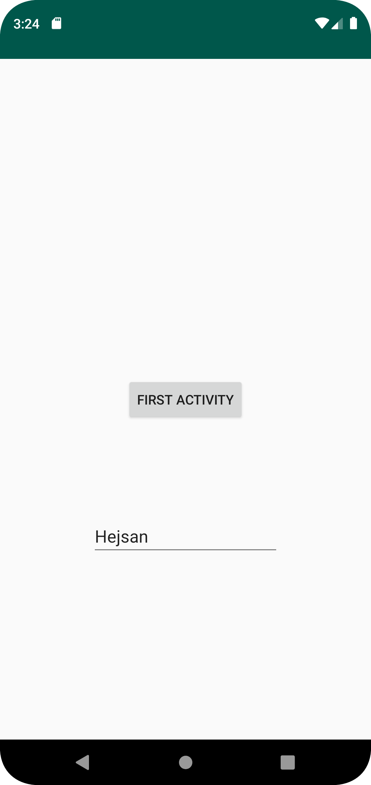

# Rapport

I denna uppgift har två aktiviteter kopplats ihop med varandra genom en knapp. Denna knapp låter användaren gå från en sida till en annan. I aktivitet 1 kan text bli funnen som ändras beroende på vad användaren skriver in i textEdit på aktivitet 2:s sida. Nedan kan man läsa en del av koden från "second_activity" där shared preference exempelvis har använts:

```
@Override
    protected void onCreate(Bundle savedInstanceState) {
        super.onCreate(savedInstanceState);
        setContentView(R.layout.second_activity);

        editing_Text = findViewById(R.id.editing_text);
        preferences = getSharedPreferences("preferences", MODE_PRIVATE);

        close_Second_Activity = findViewById(R.id.close_second_activity);
        close_Second_Activity.setOnClickListener(new View.OnClickListener() {
            @Override
            public void onClick(View view) {

                SharedPreferences.Editor editor = preferences.edit();
                editor.putString("name", editing_Text.getText().toString());
                editor.apply();

                finish();
            }
        });
    }
```

Nedan kan man se en bild på hur appen ser ut från second activity:

